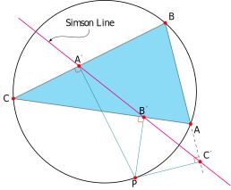

# Euclidea: A tikz library for Euclidean geometry constructions.

## Introduction

Euclidea is a tikz library designed for enchancing tikz in Euclidean geometry drawings and provides the following interfaces:

### Commands

- `\axes (xmin:xmax, ymin:ymax);`: creates x-axis and y-axis with the range from (xmin,ymin) to (xmax, ymax).
- `\ellipse [options] (a,b);`: creates an ellipse with semi-major/minor axes (a,b).
- `\hyperbola [options] (a,b);`: creates a hyperbola with semi-major/minor axes (a,b).
- `\asymptote [options] (a,b);`: creates the asymptotes of above hypterbola.
- `\parabola [options] (a,b,c);`: creates a parabola: y = a \* x ^ 2 + b \* x + c.

### Path Operations

- `affine={A,B,k}`: returns affine combination of two points, i.e. A + k \* ( B - A ).
- `midpoint={A,B}`: returns midpoint of AB.
- `translate={A,B,C}`: returns translation of point C by the vector AB, i.e. C + ( B - A ).
- `reflect={A,B,C}`: reflects point C across line AB.
- `project={A,B,C}`: projects point C onto line AB.
- `inverse={O,A,P}`: returns the inverse point of point C with respect to circle(O,A).
- revolve
  - `revolve/scale=k`: set the scale of rotation angle(positive or negative), default: 1.0;
  - `revolve/angle=a`: set the rotation angle = a(degrees);
  - `revolve/angle={P}`: set the rotation angle = the angle between OP and x-axis;
  - `revolve/angle={P1,P2}`: set the rotation angle = the angle between OP2 and OP1;
  - `revolve/angle={P1,P2,P3}`: set the rotation angle = the angle between P3P1 and P2P1;
  - `revolve/angle={P1,P2,P3,P4}`: set the rotation angle = the angle between P4P3 and P2P1;
  - `revolve={A,B}`: rotates point B by the angle around point A.
- `angle bisector={A,B,C}`: alias for `[revolve/angle={A,B,C},revolve/scale=.5,revolve={A,B}]`.
- `erect={A,B}`: alias for `[revolve/angle=90,revolve={A,B}]`.
- `equilateral={A,B}`: alias for `[revolve/angle=60,revolve={A,B}]`.
- intercept
  - `intercept/length=a`: set the length of intercept operation = `a`.
  - `intercept/length={P1,P2}`: set the length of intercept operation = `|P1P2|`.
  - `intercept/scale=k`: set the scale of intercept length, default: 1.0.
  - `intercept={A,B}`: intercepts a line segment (starting from point A) of a certain length on line AB.
- `intersect={A,B,C,D}`: returns the intersection of line AB and line CD.
- `perpendicular bisector={A,B}`: creates the perpendicular bisector of segment AB.
- `perpendicular={A,B,C}`: creates a line through point C perpendicular to line AB.
- `parallel={A,B,C}`: creates a line through point C parallel to line AB.
- `extend={A,B}`: alias for `[parallel={A,B,A}]`.
- `circumcenter={A,B,C}`: returns the circumcenter of a triangle.
- `orthocenter={A,B,C}`: returns the orthocenter of a triangle.
- `incenter={A,B,C}`: returns the incenter of a triangle.
- `excenter={A,B,C}`: returns the excenter of a triangle.
- `nine-point center={A,B,C}`: returns the nine-point center of a triangle.
- `circle={O,A}`: creates a circle with the center (O) through point A.
- `tangent point={O,A,P}`: returns the tangent point of the tangent (to the left of vector OP) through point P to the circle {O,A}.
- `external center={O1,A1,O2,A2}`: returns the external homothetic center of two circles.
- `internal center={O1,A1,O2,A2}`: returns the internal homothetic center of two circles.
- `radical axis={O1,A1,O2,A2}`: creates the radical axis of two non-concentric circles.
- `circle-line={O,A,P,Q}`: creates circle-line instersections (named: cl1, cl2) of circle (O, A) and line (P, Q).
- `circle-circle={O1,A1,O2,A2}`: creates circle-circle instersections (named: cc1, cc2) of circle O1(O1, A1) and circle O2(O2, A2).
- `transform = {angle:(xshift,yshift)}`: rotates around the origin by `angle` and then shifts by (`xshift`,`yshift`).

### Conics

- Ellipse

  - `ellipse/define = {F1,F2,P}`: define an ellipse with two foci and a point.
  - `ellipse`: creates the ellipse path.
  - `ellipse/directrix/scale=k`: set the scale of directrices.
  - `ellipse/directrix`: create the directrices.
  - `ellipse/axis/scale=k`: set the scale of axes.
  - `ellipse/axis`: create the axes.
  - `ellipse/a`, `ellipse/b`, `ellipse/c`, `ellipse/e`: ellipse semimajor-axis, semiminor-axis, linear eccentricity, eccentricity.

- Hyperbola

  - `hyperbola/define = {F1,F2,P}`: define a hyperbola with two foci and a point.
  - `hyperbola/domain=t1:t2`: set the domain for parametric equation: x = a*cosh(t), y = b*sinh(t).
  - `hyperbola`: creates the hyperbola path.
  - `hyperbola/directrix/scale=k`: set the scale of directrices.
  - `hyperbola/directrix`: create the directrices.
  - `hyperbola/axis/scale=k`: set the scale of axes.
  - `hyperbola/axis`: create the axes.
  - `hyperbola/a`, `hyperbola/b`, `hyperbola/c`, `hyperbola/e`: hyperbola semimajor-axis, semiminor-axis, linear eccentricity, eccentricity.

- Parabola

  - `parabola/define = {F,V}`: define a parabola with the focus and vertex.
  - `parabola/domain=t1:t2`: set the domain for parametric equation: x = a*t^2, y = 2a*t, where `a` is the distance from the focus to the vertex.
  - `parabola`: creates the parabola path.
  - `parabola/directrix/scale=k`: set the scale of directrix.
  - `parabola/directrix`: create the directrix.
  - `parabola/axis/scale=k`: set the scale of axis.
  - `parabola/axis`: create the axis.
  - `parabola/a`, `parabola/e`: 1/4 parabola latus rectum, eccentricity (1.0).

## Example

Here is TikZ code for drawing Simson line.

```
\documentclass{standalone}
\usepackage{tikz}
\usetikzlibrary{euclidea,quotes,angles}

\begin{document}
\begin{tikzpicture}
  \coordinate (A) at (4,0);
  \coordinate (B) at (3,4);
  \coordinate (C) at (-3,1);
  \coordinate[circumcenter={A,B,C}] (O);
  % fetch fetch an arbitrary point on the circumcirle
  \coordinate[revolve/angle=-50,revolve={O,A}] (P);
  % perpendicular feet
  \coordinate (A') at ($(B)!(P)!(C)$);
  \coordinate (B') at ($(C)!(P)!(A)$);
  \coordinate (C') at ($(A)!(P)!(B)$);

  \draw[thick,fill=cyan,opacity=.45] (A) -- (B) -- (C) -- cycle;
  \draw[thick,circle={O,A}];
  % perpendicular lines
  \draw[teal,perpendicular={B,C,P}];
  \draw[teal,perpendicular={C,A,P}];
  \draw[teal,perpendicular={A,B,P}];
  \draw[thick,magenta,
    start modifier=-.5,end modifier=1.25,
    extend={A',C'}];%simson line
  \draw (0,4) node (L) {Simson Line};
  \draw[->,>=latex] (L) to[out=-90,in=45] ($(A')!-.25!(C')$);

  \pic[draw,red,angle radius=2mm]{right angle= P--A'--C};
  \pic[draw,red,angle radius=2mm]{right angle= P--B'--C};
  \pic[draw,red,angle radius=2mm]{right angle= P--C'--A};
  \draw[dashed,extend={A,C'}];

  \foreach \p/\placement in {A/below right, B/above right,
  C/left, A'/above, B'/above, C'/above right, P/below}{
    \fill[red] (\p) circle (2pt);
    \draw (\p) node[\placement] {$\p$};
  }
\end{tikzpicture}
\end{document}
```

The result:



## License

MIT License
